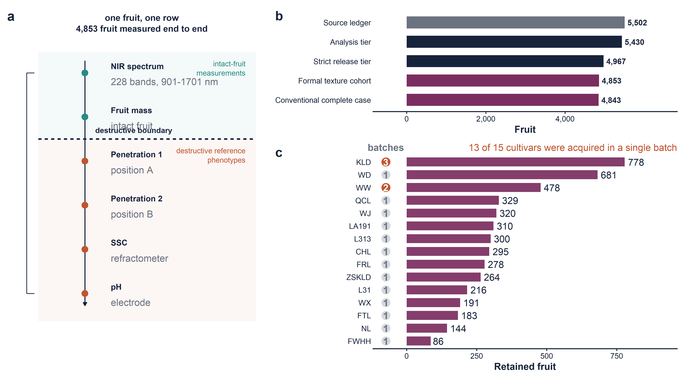
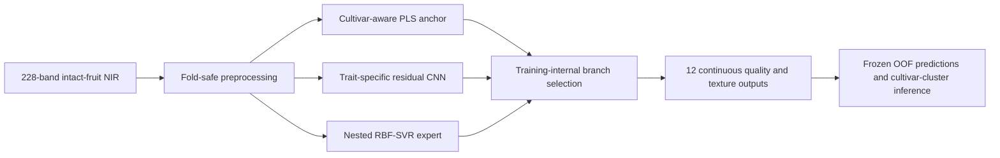

# PlumSPECTRA

Private peer-review repository for a cultivar-aware near-infrared framework that
predicts fruit weight, soluble solids content, pH and nine mechanical texture
endpoints from intact plums.

> **Review status:** private `1.0.0-rc.1`. Author metadata, public licenses, DOI
> records and final deployment weights are deliberately not claimed as complete.



## What is frozen

- 5,502 identity-linked fruit in the source ledger.
- 4,853 quality-controlled fruit from 15 cultivars for texture modelling.
- 12 independently fitted trait targets and five cultivar-stratified outer folds.
- 58,206 out-of-fold fruit-trait predictions.
- Final R²: 0.827 for fruit weight, 0.629 for SSC, 0.544 for pH and 0.502–0.719 for texture.
- Branch-excluded RMSE gains of 0.86–4.01% over the strongest independent baseline;
  all 12 simultaneous intervals exclude zero.

## Evidence boundary

The primary result is interpolation inside the registered 15-cultivar acquisition
domain. It is not external orchard, year, instrument or unseen-cultivar validation.
Five held batches from two cultivars support labelled adaptation only; zero-shot
leave-one-cultivar-out transfer failed for every texture endpoint.



## Repository map

- `analysis/`: analysis, training, figure and audit scripts retained for provenance.
- `configs/`: cultivar, trait and model registries.
- `evidence/`: frozen predictions, metric tables, figure source data and audit outputs.
- `paper/`: anonymous manuscript sources and six main figures.
- `tools/audit_release.py`: repository integrity and privacy audit.
- `tests/`: clean-environment checks for the frozen evidence.

Related private repositories:

- [`PlumSPECTRA-data`](https://github.com/707728642li/PlumSPECTRA-data): analysis-ready spectra, phenotypes, folds and prediction records.
- [`PlumSPECTRA-models`](https://github.com/707728642li/PlumSPECTRA-models): model card, configuration registry and deployment-weight release status.

## Reviewer quick check

```bash
python -m pip install pandas pyarrow pytest pyyaml
python tools/audit_release.py
pytest -q
```

The check recomputes file hashes, cohort sizes and selected headline metrics. It does
not retrain the neural networks. Full retraining requires the private analysis-ready
dataset and substantial GPU time.

## Data, model and code availability

The private data repository contains a path-free analysis table and the frozen OOF
predictions. Raw ARC archives and instrument exports are not copied into Git history.
The model repository does not mislabel the older nine-trait production bundle as the
paper's final 12-trait system; final refit weights remain a release blocker.

## Citation and license

The final author list, public licenses and version DOI will be added after author and
institutional confirmation. Until then, all three repositories remain private and
all rights are reserved.
